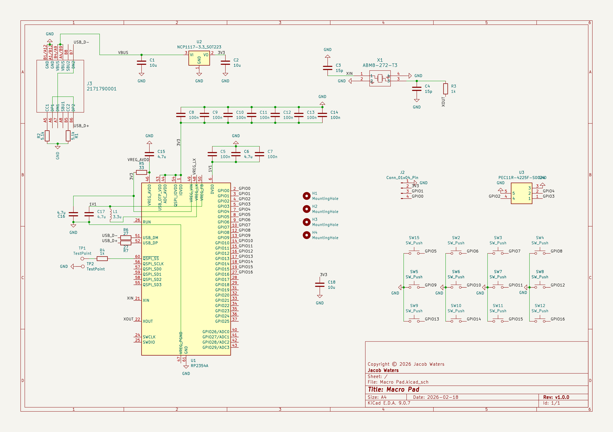

# Macro Pad

A macro pad featuring 12 customisable mechanical keys, a customisable rotary encoder with button, and an OLED display. Based on the RP2354A microcontroller and MicroPython firmware.

##

  
  
  
  
  
  
  

##

## How to Use
Plug the Macro Pad into your Windows, Linux, or macOS device using a USB C cable to begin using it immediately. The OLED display shows the function of each key, and the rotary encoder. To enter safe mode (REPL) hold the rotary encoder button then plug the device into a computer, you can then connect to the REPL.

## Coming Soon
 - Change key mappings directly on the device by holding the rotary encoder button for 2 seconds. Then press the key you want to modify, or rotate/click the encoder to configure it. The OLED display will show a list of available options for the selected input. Use the rotary encoder to scroll through options and press it to confirm your selection. A custom MicroPython port will also be included.
 - A Windows app that will allow you to update and configure settings for the Macro Pad.

## Why I Made This
I built this project to create a fully customisable and open-sourced macro pad. It has also served as a way to develop my skills in schematic design, PCB layout, and 3D Modelling.

## Features
 - USB C
 - 12 macro buttons
 - Rotary encoder with switch
 - 128 x 64 OLED display
 - 3D printable housing
 - RP2354A microcontroller
 - 2MB internal flash storage
 - Micropython firmware

## Bill Of Materials
|Item                          |Description                               |Quantity|Unit Price (£)|Total Price (£) Inc. Tax|URL                                                                                                               |
|------------------------------|------------------------------------------|--------|--------------|------------------------|------------------------------------------------------------------------------------------------------------------|
|KGM21AR50J106KU               |10uf M2012 6.3V X5R 10% Ceramic Capacitor |2       |£0.15         |£0.30                   |https://www.mouser.co.uk/ProductDetail/KYOCERA-AVX/KGM21AR50J106KU?qs=Jm2GQyTW%2FbgeDRGArSXNqw%3D%3D              |
|04026A150KAT2A                |15pf M1005 6.3V C0G 10% Ceramic Capacitor |2       |£0.20         |£0.41                   |https://www.mouser.co.uk/ProductDetail/KYOCERA-AVX/04026A150KAT2A?qs=%252B6g0mu59x7JAoQBM1pv8rw%3D%3D             |
|C0402C104K9PAC                |100nf M1005 6.3V X5R 10% Ceramic Capacitor|9       |£0.09         |£0.81                   |https://www.mouser.co.uk/ProductDetail/KEMET/C0402C104K9PAC?qs=AHS6Mz2dKxOwTpYKcRVQ5A%3D%3D                       |
|04026D475KAT2A                |4.7u M1005 6.3V X5R 10% Ceramic Capacitor |4       |£0.25         |£0.99                   |https://www.mouser.co.uk/ProductDetail/KYOCERA-AVX/04026D475KAT2A?qs=NnBbvHfz1MlsASN%2FEU18Fg%3D%3D               |
|KGM05CR50J106MH               |10uf M1005 6.3V X5R 20% Ceramic Capacitor |1       |£0.29         |£0.29                   |https://www.mouser.co.uk/ProductDetail/KYOCERA-AVX/KGM05CR50J106MH?qs=Jm2GQyTW%2FbhpTcrSSOU%2Fog%3D%3D            |
|M22-2010446                   |Pin Header                                |1       |£0.19         |£0.19                   |https://www.mouser.co.uk/ProductDetail/Harwin/M22-2010446?qs=xxdqPuaJ%252Ba1u1bOnRTZmWA%3D%3D                     |
|217179-0001                   |USB 2.0 Type C Connecter                  |1       |£0.62         |£0.62                   |https://www.mouser.co.uk/ProductDetail/Molex/217179-0001?qs=DRkmTr78QAQqCH4BoIR1xg%3D%3D                          |
|Abracon AOTA-B201610S3R3-101-T|3.3uH Inductor                            |1       |£0.16         |£0.16                   |https://www.mouser.co.uk/ProductDetail/ABRACON/AOTA-B201610S3R3-101-T?qs=%252BXxaIXUDbq0IZvJW%2F2mv4w%3D%3D       |
|RCC04025K10FKED               |5.1KOhms M1005 75V 125mW 1% Resistor    |2       |£0.13         |£0.26                   |https://www.mouser.co.uk/ProductDetail/Vishay-Dale/RCC04025K10FKED?qs=sGAEpiMZZMtlubZbdhIBIKF%2FTFcY2hSp3tUvUjd6Vvc%3D      |
|NT0402BRD071KL                |1KOhms M1005 75V 50mW 0.1% Resistor       |2       |£0.47         |£0.95                   |https://www.mouser.co.uk/ProductDetail/YAGEO/NT0402BRD071KL?qs=QpmGXVUTftHMxPCRkfl19A%3D%3D                       |
|RC0402FR-7D33RL               |33Ohms M1005 50V 62.5mW 1% Resistor       |1       |£0.08         |£0.08                   |https://www.mouser.co.uk/ProductDetail/YAGEO/RC0402FR-7D33RL?qs=sGAEpiMZZMtlubZbdhIBIAA5Rg%252BBqQHDmyOm95fgtck%3D|
|AC0402FR-0727RL               |27Ohms M1005 50V 62.5mW 1% Resistor       |2       |£0.08         |£0.15                   |https://www.mouser.co.uk/ProductDetail/YAGEO/AC0402FR-0727RL?qs=sGAEpiMZZMtlubZbdhIBINBo7nw4llFty0bqbz0wZcs%3D    |
|MX3A-L1NN                     |Cherry MX Silent Red Mechanical Switch    |12      |£0.84         |£10.09                  |https://www.mouser.co.uk/ProductDetail/CHERRY/MX3A-L1NN?qs=F5EMLAvA7IDjdmws2ay6wg%3D%3D                           |
|SC1511-A4                     |RP2354A Microcontroller                   |1       |£0.83         |£0.83                   |https://www.mouser.co.uk/ProductDetail/Raspberry-Pi/SC1511-A4?qs=4dK74SdgGtwccC2I02Q7DA%3D%3D                     |
|NCP1117ST33T3G                |LDO 3.3V 1A Voltage Regulator             |1       |£0.44         |£0.44                   |https://www.mouser.co.uk/ProductDetail/onsemi/NCP1117ST33T3G?qs=Gev%252BmEvV0iZb%2FE8ahUDx3w%3D%3D                |
|PEC11R-4225F-S0024            |Rotary Encoder With Switch                |1       |£1.55         |£1.55                   |https://www.mouser.co.uk/ProductDetail/Bourns/PEC11R-4225F-S0024?qs=Zq5ylnUbLm4N6UNkPX3pkQ%3D%3D                  |
|ABM8-272-T3                   |12MHz Crystal                             |1       |£0.41         |£0.41                   |https://www.mouser.co.uk/ProductDetail/ABRACON/ABM8-272-T3?qs=QpmGXVUTftEj6miOiJBMxQ%3D%3D                        |
|SAK-014                       |Rotary Encoder Knob                       |1       |£2.58         |£2.58                   |https://www.mouser.co.uk/ProductDetail/Same-Sky/SAK-014?qs=HMhDvBYWqvNLNdCW76EFlA%3D%3D                           |
|PRT-15305                     |Cherry MX Keycap                          |12      |£0.79          |£9.46                    |https://www.mouser.co.uk/ProductDetail/SparkFun/PRT-15305?qs=EBDBlbfErPzfsnccoEI2Mg%3D%3D                         |
|SSD1306                       |128x64 I2C OLED Display                   |1       |£5.99          |£5.99                    |https://www.amazon.co.uk/Electro-Saturn-SSD1306-Display-Arduino-ESP8266/dp/B0G1KXV542/                            |
