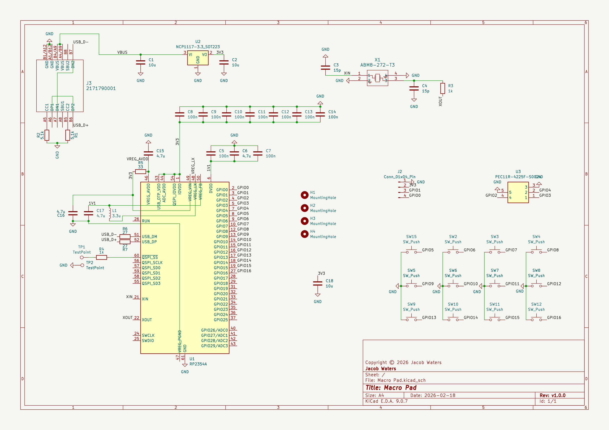

# Macro Pad

A macro pad featuring 12 customisable mechanical keys, a customisable rotary encoder with button, and an OLED display. Based on the RP2354A microcontroller and MicroPython firmware.

##

  
  
  
  
  
  
  

##

## How to Use
Plug the Macro Pad into your Windows, Linux, or macOS device using a USB C cable to begin using it immediately. The OLED display shows the function of each key, and the rotary encoder. To enter safe mode (REPL) hold the rotary encoder button then plug the device into a computer, you can then connect to the REPL.

## Coming Soon
 - Change key mappings directly on the device by holding the rotary encoder button for 2 seconds. Then press the key you want to modify, or rotate/click the encoder to configure it. The OLED display will show a list of available options for the selected input. Use the rotary encoder to scroll through options and press it to confirm your selection. A custom MicroPython port will also be included.
 - A Windows app that will allow you to update and configure settings for the Macro Pad.

## Why I Made This
I built this project to create a fully customisable and open-sourced macro pad. It has also served as a way to develop my skills in schematic design, PCB layout, and 3D Modelling.

## Features
 - USB C
 - 12 macro buttons
 - Rotary encoder with switch
 - 128 x 64 OLED display
 - 3D printable housing
 - RP2354A microcontroller
 - 2MB internal flash storage
 - Micropython firmware

## Bill Of Materials
|Item                  |Description                                                            |Quantity|Unit Price (£)|Total Price (£) Inc. Tax|URL                                                  |
|----------------------|-----------------------------------------------------------------------|--------|--------------|------------------------|-----------------------------------------------------|
|CL05A104KA5NNNC       |100nF ±10% 25V Ceramic Capacitor X5R 0402                              |100     |$0.0016       |$0.16                   |https://www.lcsc.com/product-detail/C100072.html     |
|CC0402KRX5R5BB103     |10nF ±10% 6.3V Ceramic Capacitor X5R 0402                              |100     |$0.0012       |$0.12                   |https://www.lcsc.com/product-detail/C1853984.html    |
|CL21B103KBANNNC       |10nF ±10% 50V Ceramic Capacitor X7R 0805                               |50      |$0.0066       |$0.33                   |https://www.lcsc.com/product-detail/C1710.html       |
|ABM8-272-T3           |±30ppm 10pF ±30ppm SMD3225-4P Crystals RoHS                            |5       |$0.2902       |$1.45                   |https://www.lcsc.com/product-detail/C20625731.html   |
|CL05C150JB5NNNC       |15pF ±5% 50V Ceramic Capacitor C0G 0402                                |100     |$0.0036       |$0.36                   |https://www.lcsc.com/product-detail/C86285.html      |
|RC0402FR-071KL        |1kΩ 62.5mW 50V Thick Film Resistor ±100ppm/℃ ±1% 0402 Chip Resistor   |100     |$0.0008       |$0.08                   |https://www.lcsc.com/product-detail/C106235.html     |
|RC0402FR-0727RL       |27Ω ±1% 62.5mW 0402 Thick Film Resistor                                |100     |$0.0008       |$0.08                   |https://www.lcsc.com/product-detail/C138021.html     |
|AOTA-B201610S3R3-101-T|2.1A 3.3uH 115mΩ 2.4A Molded Inductor 0806 Fixed Inductors RoHS        |5       |$0.2888       |$1.44                   |https://www.lcsc.com/product-detail/C42411119.html   |
|RC0402FR-0733RL       |62.5mW 33Ω 50V Thick Film Resistor ±100ppm/℃ ±1% 0402 Chip Resistor   |100     |$0.0009       |$0.09                   |https://www.lcsc.com/product-detail/C138002.html     |
|CL05A475KQ5NRNC       |4.7uF ±10% 6.3V Ceramic Capacitor X5R 0402                             |100     |$0.0060       |$0.60                   |https://www.lcsc.com/product-detail/C2932473.html    |
|0402WGF5101TCE        |5.1kΩ ±1% 62.5mW 0402 Thick Film Resistor                              |100     |$0.0008       |$0.08                   |https://www.lcsc.com/product-detail/C25905.html      |
|NCP1117ST33T3G        |Linear Voltage Regulator IC Positive Fixed 1 Output 1A SOT-223         |5       |$0.2615       |$1.31                   |https://www.lcsc.com/product-detail/C26537.html      |
|PZ254V-11-04P         |Pin Header 4 Position 2.54mm Pitch Single Row Through Hole -40℃~+105℃|20      |$0.0236       |$0.47                   |https://www.lcsc.com/product-detail/C2691448.html    |
|Rotary Encoder Knob   |22x12mm 6mm D-Type Shaft Hole Knob                                     |1       |$1.6500       |$1.65                   |https://www.aliexpress.com/item/1005011592374989.html|
|SSD1306               |128x64 I2C OLED Display                                                |1       |$0.9900       |$0.99                   |https://www.aliexpress.com/item/1005008995931139.html|
|PEC11R-4225F-S0024    |Plugin Encoders RoHS                                                   |1       |$1.8539       |$1.85                   |https://www.lcsc.com/product-detail/C18198884.html   |
|Cherry MX Keycaps     |Blank black keycap for Cherry MX switches                              |20      |$0.1500       |$3.00                   |https://www.aliexpress.com/item/1005007572331245.html|
|Cherry MX Red Switch  |Cherry MX red 3-pin linear switches                                    |20      |$0.3540       |$7.08                   |https://www.aliexpress.com/item/1005007983672026.html|
|RP2354A               |QFN-60(7x7) Microcontrollers RoHS                                      |1       |$1.4615       |$1.46                   |https://www.lcsc.com/product-detail/C41378174.html   |
|2171790001            |USB 2.0 5A 1 16P -40℃~+85℃ SMD USB Connector Assemblies RoHS         |1       |$0.6229       |$0.62                   |https://www.lcsc.com/product-detail/C3197684.html    |
